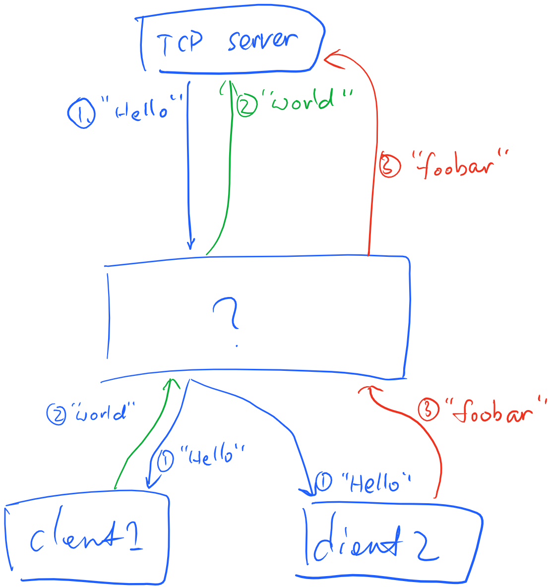
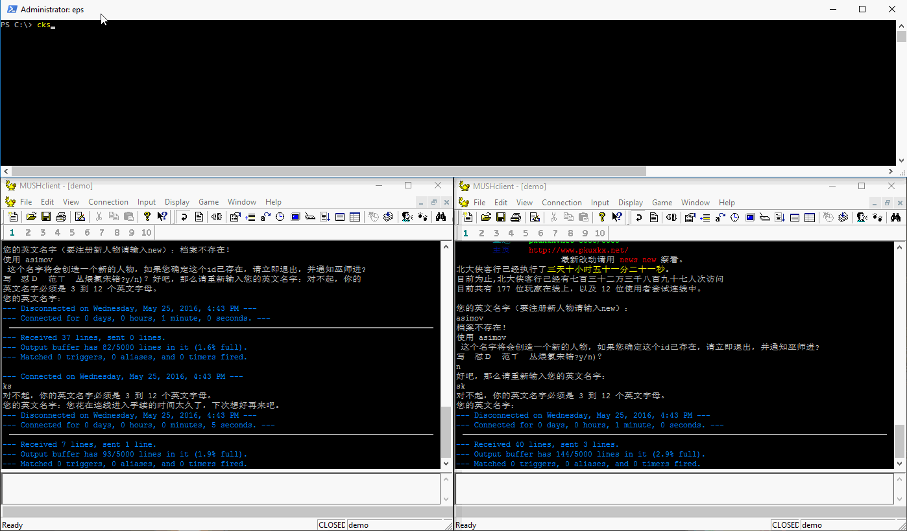

# multiplexer

Sharing a server TCP connection between multiple clients

## Install

_As the pre release, I only build this for Windows platform. But you can build
it on other platforms using Mono. It should be easy since there's no external
dependencies._

Grab the binary from [release](https://github.com/kflu/multiplexer/releases).
Or via [NPM](https://www.npmjs.com/package/tcpmultiplexer):

    npm install -g tcpmultiplexer

## Usage

1. Start the multiplexer from command line
2. Connect clients to localhost:3333
3. In multiplxer command line, input command `connect <server> <port>` to connect to the remote service that will be shared by all the clients.
4. At any time, you can terminate a client, or connect a new client, without affecting the connection to the remote server.

## Introduction

This tool allows multiple TCP clients to share a single TCP connection to 
a server. Traffic generated by the server is forwarded to all clients. Traffic
generated from any client is forwarded to the server.

This graph demonstrates the idea

How is it useful? In many cases, we want to write program to automate tasks
with a remote service, but at the same time want to keep using the existing
tool that doesn't offer the functionality that your automation program is
capable of, but provides an easy/familiar UI, so that your automation program 
won't have to.

Here's a demonstration of it in action. As an example, in this case, there're
two MUD clients sharing the same connection to the server. Imagine one of the
two clients is a thin program that automates your player, but provides no
ability for human intervention. And the other client is a regular feature-rich
MUD client that you can interact with.

